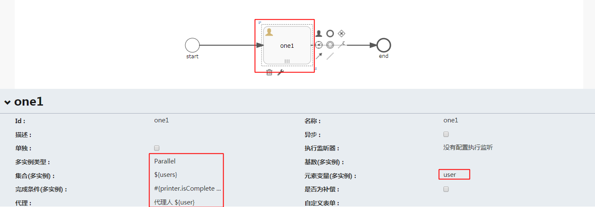

## 会签
设置下面的信息

Parallel是并行操作, user是自定义变量 , ${user}是应用元素变量的值 , #{printer.isComplete..}
是Java方法(用来判断完成条件) .
>需要把这个类注册  
>随便找一个配置类注进去
```Java
@Configuration
public class Test {
    @Bean
    public Printer printer(){
        return  new Printer();
    }
}
```
>自定义一个类  
>这个类是负责检验完成情况的
```Java
public class Printer {

    public boolean isComplete(ActivityExecution execution){
        //完成会签的次数
        Integer completeCounter=(Integer)execution.getVariable("nrOfCompletedInstances");
        //会签总数
        Integer instanceOfNumbers=(Integer)execution.getVariable("nrOfInstances");
        System.out.println(completeCounter);
        System.out.println(instanceOfNumbers);
        //会签触发人
        System.out.println(execution.getActivity());
        return false;
    }
}
```
>添加会签人员   
>在开启流程的方法中添加参数users要和上面的集合(多实例)的对应上
```Java
        List list = new ArrayList();
        list.add("zzz");
        list.add("xxx");
        list.add("aaa");
        list.add("bbb");
        variables.put("users", list);
        ProcessInstance vacationInstance = runtimeService.startProcessInstanceByKey(key, variables);
```